gm. i'm impaler. 
i write the solidity, the backend that watches it, the bot that trades on it, 
and i run the room where everyone argues about it.

six worlds, one for everything i work on. walk them properly at <a href="https://impaler.dev">impaler.dev</a> · cv at <a href="https://thyimpaler.xyz">thyimpaler.xyz</a>

 

**[nest](https://nest-rh.xyz)** · head of dev · no-code erc-721 launchpad on robinhood chain, live on mainnet. 95% of primary mint goes to the creator and the contract is what enforces it.\
**$CHAD** · nft dev · first nft on besc hyperchain. built the data layer that took it live.

> *"We were nervous at first about how the NFTs would even go — this dude made it so much better that all our expectations felt like bare minimum for us."* — chad

 

**[keypass](https://keypass-gateway.vercel.app)** · head of dev · passes with a dollar cap, a model and an expiry. every request is priced at its worst case and reserved in one postgres transaction before it goes out. pull the row lock and the tests let 12 through on a cap of 10, so the lock stays. keys sealed with aes-256-gcm.

 

**nest indexer** · stores the hash of the last block it read. reorg hits, it rewinds and replays instead of quietly eating a mint.\
**phantom bridge** · dev & admin · telegram desk for besc. wallets, bridging to bnb and eth, a pnl board, and a real recovery path for stuck wbesc instead of a support ticket.

> *"One word for you — all-rounder."* — balthazar, phantom cto

 

**alpha signals** · reads x for narratives forming, ranks the tokens riding them, pings before the rotation is obvious.\
**[cipv1](https://cipv-1.vercel.app)** · **[csc1](https://csc1.vercel.app)** · research to execution, and a live order book / correlation board.\
memecoins and perps since 2024. orderflow and liquidity. retired ict a while back.

 

**[$RIGGK](https://riggk.vercel.app)** · penalty shootout on solana. burn for attempts, beat a keeper that remembers you.\
**[henny run](https://henny-run.vercel.app)** · 3d endless runner. dodge the fud, collect bones, skins unlock by what your wallet holds.

 

head mod at **$HENNY** through a $105k all-time high. moderating **klein funding**, 33k members. 100% uptime.

> *"Impaler really held the team together, from the days we started and till we got the attention on CT, he never showed any lack in his work."* — frontman

 

  <code>solidity</code> <code>typescript</code> <code>react</code> <code>next</code> <code>three.js</code> <code>phaser</code> <code>node</code> <code>fastify</code> <code>postgres</code> <code>prisma</code> <code>viem</code> <code>ethers</code> <code>solana/web3.js</code> <code>telegraf</code> <code>python</code> <code>docker</code>

  
  

  
    <a href="https://x.com/Thy_Impaler">x</a> ·
    <a href="https://t.me/ThyImpaler">telegram</a> ·
    <a href="https://discord.com/users/thyimpaler_">discord</a> ·
    <a href="mailto:work@thyimpaler.xyz">work@thyimpaler.xyz</a>
  

