<!-- Header -->
<p align="center">
  
</p>

<p align="center">
  <a href="https://impaler.dev">
    
  </a>
</p>

<p align="center">
  <a href="https://impaler.dev"></a>
  <a href="https://thyimpaler.xyz"></a>
  <a href="https://x.com/Thy_Impaler"></a>
  <a href="https://t.me/ThyImpaler"></a>
  <a href="https://discord.com/users/thyimpaler_"></a>
  <a href="mailto:work@thyimpaler.xyz"></a>
</p>

<p align="center">
  
</p>

---

<p align="center">
  
</p>

## 🧬 `impaler.ts`

```ts
const impaler = {
  role:      ["Full-stack dev", "Smart-contract dev", "Community lead"],
  chains:    ["Ethereum", "Solana", "Base", "BESC Hyperchain", "Robinhood Chain"],
  nowBuilding: {
    KEYPASS: "share AI access without sharing the key",
    Nest:    "permissionless NFT launchpad, live on Robinhood Chain mainnet",
  },
  trading:   { since: 2024, plays: ["memecoins", "perps"], reads: "orderflow + liquidity" },
  funFact:   "shipped the first NFT on BESC Hyperchain",
  rule:      "a thin true line beats a padded false one",
} as const;
```

## 📈 By the numbers

<table align="center">
  <tr>
    <td align="center" width="25%"><h1>100%</h1><sub>uptime</sub></td>
    <td align="center" width="25%"><h1>12</h1><sub>products shipped &amp; deployed</sub></td>
    <td align="center" width="25%"><h1>33K</h1><sub>members moderated at Klein Funding</sub></td>
    <td align="center" width="25%"><h1>$105K</h1><sub>$HENNY all-time high, held through the volatility</sub></td>
  </tr>
</table>

## 🛠️ Things I've shipped

| | Project | What it does | Try it |
|:-:|---|---|:-:|
| 🔐 | **KEYPASS** | Share AI access, never your key: passes with a $ cap, a model and an expiry, enforced by a Postgres ledger that can't be raced past its limit | [live ↗](https://keypass-gateway.vercel.app) |
| 🪺 | **Nest** | No-code ERC-721 launchpad on Robinhood Chain: factory contracts, reorg-safe indexer, 95% to creators | [live ↗](https://nest-rh.xyz) |
| 👻 | **Phantom Bridge** | Telegram trading desk for BESC with wallets, bridging to BNB/ETH, a PnL board and stuck-funds recovery | 🤖 bot |
| 📡 | **Alpha Signals** | Watches X for narratives forming and ranks the tokens riding them before the rotation is obvious | 🤖 bot |
| ⚽ | **$RIGGK** | Penalty-shootout arcade on Solana: burn for attempts, beat an AI keeper that gets smarter as you streak | [play ↗](https://riggk.vercel.app) |
| 🐶 | **Henny Run** | 3D endless runner in the browser. Dodge the FUD, collect bones, unlock skins | [play ↗](https://henny-run.vercel.app) |
| 📊 | **CIPV1** · **csc1** | Crypto research → automated trades, plus a live order-book / correlation dashboard | [live ↗](https://cipv-1.vercel.app) |
| 🎙️ | **ZenCode** | Voice your code, watch it stream to your phone, approve with a glance | [repo ↗](https://github.com/thyimpaler/ZenCode) |

<details>
<summary><b>🗂️ Roles I've held (click to expand)</b></summary>
<br />

| Role | Where | When |
|---|---|---|
| Founder & Engineer | **KEYPASS**, AI access gateway | Sep 2026 → now 🟢 |
| Head of Development | **Nest**, NFT launchpad on Robinhood Chain | Jul 2026 → now 🟢 |
| Moderator | **Klein Funding**, 33K members | Apr 2026 → now 🟢 |
| Head Moderator | **$HENNY**, BESC Hyperchain | Jan 2026 → now 🟢 |
| Head of Development | **Axyom Sites** | Jun → Aug 2026 |
| Developer & Admin | **Phantom CTO** | Apr → Jun 2026 |
| NFT Dev & Moderator | **$CHAD**, BESC Hyperchain | Feb → Jun 2026 |

</details>

## 💬 What the leads said

> *"One word for you — all-rounder."*
> **Balthazar**, project lead, Phantom CTO

> *"We were nervous at first about how the NFTs would even go — this dude made it so much better that all our expectations felt like bare minimum for us."*
> **Chad**, project lead, $CHAD

> *"Impaler really held the team together, from the days we started and till we got the attention on CT, he never showed any lack in his work."*
> **Frontman**, project lead, $HENNY

## 🧰 Toolbox

<p align="center">
  
</p>

<p align="center">
  
  
  
  
  
  
  
  
</p>

## ⚡ GitHub, but make it stats

<p align="center">
  
  
</p>

<p align="center">
  
</p>

<p align="center">
  <picture>
    <source media="(prefers-color-scheme: dark)" srcset="https://raw.githubusercontent.com/thyimpaler/thyimpaler/output/github-snake-dark.svg" />
    <source media="(prefers-color-scheme: light)" srcset="https://raw.githubusercontent.com/thyimpaler/thyimpaler/output/github-snake.svg" />
    
  </picture>
</p>

<p align="center"><i>🐍 the snake eats my commits so I have to keep making more</i></p>

<!-- Footer -->

