<p align="center">
  <a href="https://impaler.dev"></a>
</p>

gm.

i'm impaler. i write the solidity, the backend that watches it, the bot that trades on it, and i run the room where everyone argues about it.

six worlds, one for everything i work on. the full walk-through lives at [impaler.dev](https://impaler.dev), the cv at [thyimpaler.xyz](https://thyimpaler.xyz).

<br />

###  &nbsp;I · the mint

smart contracts. erc-721 factories, royalties, reentrancy guards, pull payments.

**nest** · head of dev · [nest-rh.xyz](https://nest-rh.xyz)\
permissionless nft launchpad on robinhood chain. upload art, deploy a collection, open a mint, no code. 95% of primary mint goes to the creator and the contract is what makes sure of it.

**$CHAD** · nft dev\
first nft on besc hyperchain. built the data layer that took it live.

> "We were nervous at first about how the NFTs would even go — this dude made it so much better that all our expectations felt like bare minimum for us."\
> — chad, $CHAD

###  &nbsp;II · the vault

**keypass** · head of dev · [keypass-gateway.vercel.app](https://keypass-gateway.vercel.app)\
share ai access without sharing the key. every pass gets a dollar cap, a model and an expiry. spend sits in a postgres ledger that can't be raced past its limit. pull the row lock out and the tests let 12 through on a cap of 10, so it stays in. provider keys sealed with aes-256-gcm.

###  &nbsp;III · the chain

nest's indexer keeps the hash of the last block it read, so a reorg rewinds and replays instead of quietly eating a mint.

**phantom bridge** · dev & admin\
telegram desk for besc. wallets, bridging to bnb and eth, a pnl board, and an actual recovery path for stuck wbesc instead of a support ticket.

> "One word for you — all-rounder."\
> — balthazar, phantom cto

###  &nbsp;IV · the desk

trading since 2024. memecoins and perps. i read orderflow and liquidity. retired ict a while back.

**alpha signals** · watches x for narratives forming, ranks the tokens riding them, pings before the rotation is obvious.\
**cipv1 / csc1** · research to execution, plus a live order book and correlation board. [cipv-1.vercel.app](https://cipv-1.vercel.app)

###  &nbsp;V · the arcade

**henny run** · 3d endless runner. dodge the fud, collect bones, skins unlock by what your wallet holds. [play](https://henny-run.vercel.app)\
**$RIGGK** · penalty shootout on solana. burn for attempts. go the same way twice and the keeper will be there. [play](https://riggk.vercel.app)

###  &nbsp;VI · the room

33k members at klein funding. head mod at $HENNY through a $105k peak. 100% uptime.

> "Impaler really held the team together, from the days we started and till we got the attention on CT, he never showed any lack in his work."\
> — frontman, $HENNY

<br />

```
solidity · typescript · react · next · three.js · node · fastify · postgres · prisma · viem · ethers · solana/web3.js · python · docker
```

<p align="center">
  
  
</p>

<p align="center">
  
</p>

<p align="center">
  <sub>
    <a href="https://x.com/Thy_Impaler">x</a> ·
    <a href="https://t.me/ThyImpaler">telegram</a> ·
    <a href="https://discord.com/users/thyimpaler_">discord</a> ·
    <a href="mailto:work@thyimpaler.xyz">work@thyimpaler.xyz</a>
  </sub>
  <br />
  <sub><i>touch an eye. they notice.</i></sub>
</p>
